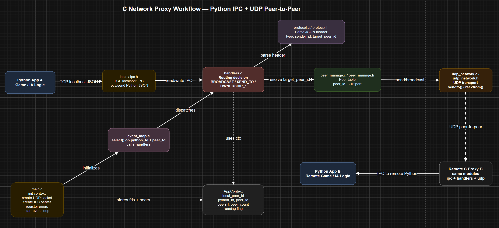
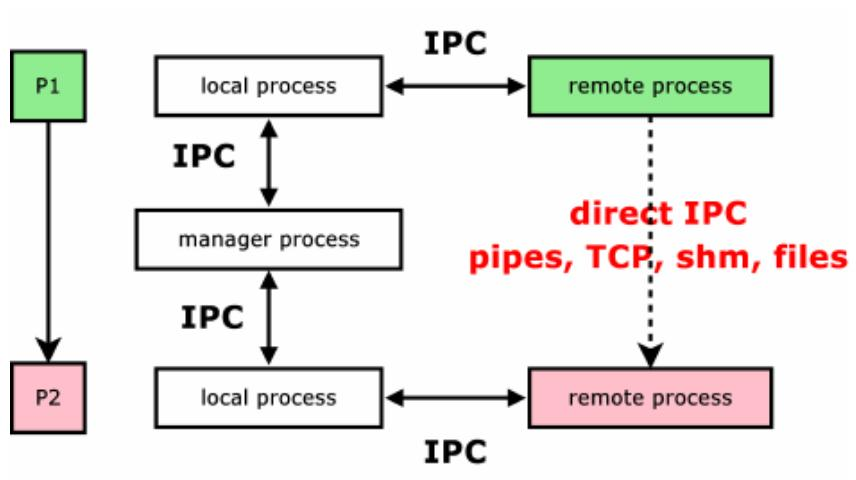
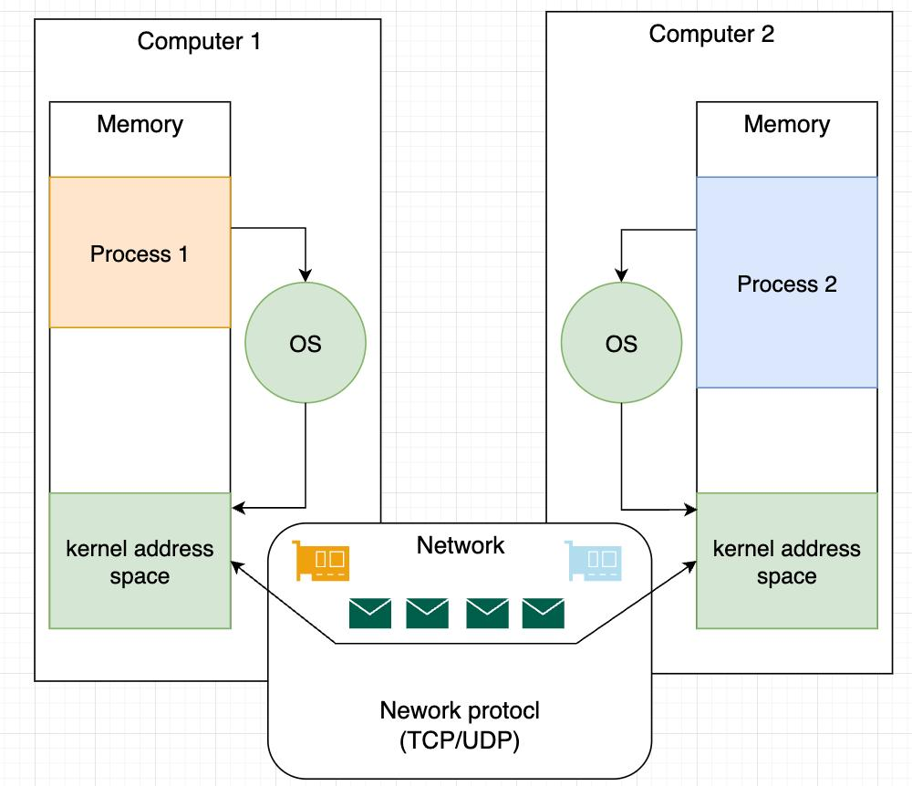

# Python Project 2025-2026: MedievAIl BAIttle GenerAIl

Distributed Python/C battle simulation with an offline mode and a peer-to-peer online mode. Each player runs an AI-controlled army locally, exchanges state with the other peers, receives remote armies, and renders the full battle from its own machine.

## Sources / Links

https://drive.google.com/file/d/1BHxEBfnQlzLeh-AHwUvqT_n3qOcvhRAp/view?usp=drive_link

https://drive.google.com/file/d/1T1PBgwUbtoPRrT4uYkOi8iOA9RJ1wf_O/view?usp=drive_link

## Table of Contents

- [About The Project](#about-the-project)
- [Built With](#built-with)
- [Architecture](#architecture)
- [Prerequisites](#prerequisites)
- [Installation](#installation)
- [Usage](#usage)
- [In-game Controls](#in-game-controls)
- [Networking Implementation](#networking-implementation)
- [Debug, Tests, and Policies](#debug-tests-and-policies)
- [Troubleshooting](#troubleshooting)

## About The Project

MedievAIl BAIttle GenerAIl is a Python/C automatic medieval battle simulator. The Python side manages the simulation, AI generals, armies, rendering, and consistency checks. The C side provides a local proxy that routes network messages between peers.

Main features:

- Medieval army battle simulation.
- Configurable AI generals, for example `MajorDaft`.
- Graphical rendering with Pygame.
- Terminal rendering with curses.
- Headless mode for quick simulation tests.
- Peer-to-peer online mode with multiple peers.
- Local C proxy for network routing.
- JSON state synchronization.
- Ownership manager to prevent multiple peers from authoritatively modifying the same army or entity.

## Built With


## 🧠 Architecture (Distributed P2P System)

The online mode uses a hybrid Python + C architecture. Each player runs two local processes: the Python game process and a C proxy process. Python is responsible for gameplay and simulation logic, while the C proxy is responsible for transport between machines.

This diagram provides a global view of how Python communicates with the C proxy and how messages are routed between peers:


---

### 🧩 IPC Model

This diagram shows how local and remote processes communicate using IPC mechanisms:



---

### 🌐 Network Stack & Distributed Communication

This diagram illustrates how processes communicate across machines through the OS kernel and network protocols (TCP/UDP):



---

### 🔄 Communication Flow

```text
Python game / AI
    <-> TCP localhost
C proxy
    <-> UDP LAN
C proxy from other peers
    <-> TCP localhost
Remote Python game / AI
```

Component responsibilities:

- Python manages the simulation, AI, armies, display, and coherence checks.
- The C proxy listens to Python over TCP on `127.0.0.1:<py_port>`.
- The C proxy sends and receives UDP packets between peers on `<lan_port>`.
- Messages are newline-framed JSON, terminated by `\n`.
- There is no permanent central server.
- In a 3-peer test on one machine, the host acts as a rendezvous point and relays packets between peers that do not yet know each other directly.

The ownership model is used to keep distributed state coherent:

- Each army or entity has an owner.
- Authoritative state updates come from the owner.
- Stale packets are ignored.
- `damage_events` allow damage to be applied by the peer that owns the target unit.
- In online mode, `Monk conversion` is disabled to avoid desync until a full unit-transfer protocol exists.

## Prerequisites

- Python 3.11+ is recommended.
- Pygame for graphical rendering:

```powershell
pip install pygame
```

- On Windows, curses support requires:

```powershell
pip install windows-curses
```

- GCC/MinGW is required if you need to rebuild the C proxy.

## Installation

From the project root:

```powershell
python --version
pip install pygame
```

The Windows proxy binary is expected at:

```text
network/src/proxy.exe
```

If you modify the C code, rebuild the proxy:

```powershell
gcc -Wall .\network\src\main.c .\network\src\app_context.c .\network\src\network.c .\network\src\ipc.c .\network\src\peer_manage.c .\network\src\handlers.c .\network\src\event_loop.c .\network\src\protocol.c -I.\network\includes -o .\network\src\proxy.exe -lws2_32
```

Linux proxy build command:

```powershell
gcc -o network/proxy_udp_real_ip.x network/proxy_udp_real_ip.c -pthread
```

Real-IP Windows proxy build command:

```powershell
gcc -o network/proxy_udp_real_ip.exe network/proxy_udp_real_ip.c -lws2_32
```

## Usage

### Offline Battle

Generic Pygame command:

```powershell
python main.py run --pygame --army_file army\*.army --map_file map\*.map --general1 (choose general ex: MajorDaft) --general2 (choose general ex: MajorDaft)
```

Concrete Pygame command:

```powershell
python main.py run --pygame --army_file army/two.army --map_file map/superflat.map --general1 MajorDaft --general2 MajorDaft
```

Generic curses command:

```powershell
python main.py run --curses --army_file army\*.army --map_file map\*.map --general1 (choose general ex: MajorDaft) --general2 (choose general ex: MajorDaft)
```

Concrete curses command:

```powershell
python main.py run --curses --army_file army/two.army --map_file map/superflat.map --general1 MajorDaft --general2 MajorDaft
```

Headless command:

```powershell
python main.py run --army_file army/two.army --map_file map/superflat.map --general1 MajorDaft --general2 MajorDaft --ticks 100
```

### Online Battle

Generic online host command:

```powershell
python main.py online --create --pygame --army_file army\*.army --map_file map\*.map --general MajorDaft
```

This creates a battle and waits for another player to connect.

Generic online join command:

```powershell
python main.py online --join 192.168.10.3 --curses --army_file army\*.army --map_file map\*.map --general MajorDaft
```

This joins a battle running on the machine with IP `192.168.10.3`.

Important online parameters:

- `--create`: creates the host.
- `--join <ip>`: joins a known host.
- `--py_port`: local TCP port between Python and the C proxy.
- `--lan_port`: local UDP port used by the C proxy.
- `--remote_port`: UDP port of the host or target peer.
- `--spawn_slot`: army spawn position.
- `--pygame`: graphical rendering.
- `--coherence_checks`: enables periodic coherence checks.

The online tick is intentionally readable:

```text
tick_delay = 0.5
```

This gives around 2 simulation ticks per second. To change the speed, modify `self.tick_delay` in `backend/GameModes/Online.py`.

### Test 2 Peers on the Same Machine

Terminal 1, host:

```powershell
python main.py online --create --general MajorDaft --army_file army/two.army --map_file map/superflat.map --py_port 5100 --lan_port 6100 --remote_port 6100 --spawn_slot 0 --pygame
```

Terminal 2, peer B:

```powershell
python main.py online --join 127.0.0.1 --general MajorDaft --army_file army/two.army --map_file map/superflat.map --py_port 5101 --lan_port 6101 --remote_port 6100 --spawn_slot 1 --pygame
```

Expected result:

- The host displays `Armees distantes connues : 1`.
- Peer B displays `Armees distantes connues : 1`.
- Both players see two armies.
- Units move and attack.
- HP must not go down and then artificially go back up.

### Test 3 Peers on the Same Machine

Terminal 1, host A:

```powershell
python main.py online --create --general MajorDaft --army_file army/two.army --map_file map/superflat.map --py_port 5100 --lan_port 6100 --remote_port 6100 --spawn_slot 0 --pygame
```

Terminal 2, peer B:

```powershell
python main.py online --join 127.0.0.1 --general MajorDaft --army_file army/two.army --map_file map/superflat.map --py_port 5101 --lan_port 6101 --remote_port 6100 --spawn_slot 1 --pygame
```

Terminal 3, peer C:

```powershell
python main.py online --join 127.0.0.1 --general MajorDaft --army_file army/two.army --map_file map/superflat.map --py_port 5102 --lan_port 6102 --remote_port 6100 --spawn_slot 2 --pygame
```

Expected result:

- A sees B and C.
- B sees A and C.
- C sees A and B.
- Each terminal eventually displays `Armees distantes connues : 2`.
- Final counters may be presented differently depending on the point of view:
  - `Army1` = the local army.
  - `Army2` = all remote armies merged together.
  - The total `Army1 + Army2` must remain coherent between peers.

### Test on Several Machines

Example with two or more machines on the same LAN.

On machine A, find the local IP:

```powershell
ipconfig
```

Assume machine A has this IP:

```text
192.168.1.20
```

Machine A, host:

```powershell
python main.py online --create --general MajorDaft --army_file army/two.army --map_file map/superflat.map --py_port 5100 --lan_port 6100 --remote_port 6100 --spawn_slot 0 --pygame
```

Machine B:

```powershell
python main.py online --join 192.168.1.20 --general MajorDaft --army_file army/two.army --map_file map/superflat.map --py_port 5101 --lan_port 6101 --remote_port 6100 --spawn_slot 1 --pygame
```

Machine C:

```powershell
python main.py online --join 192.168.1.20 --general MajorDaft --army_file army/two.army --map_file map/superflat.map --py_port 5102 --lan_port 6102 --remote_port 6100 --spawn_slot 2 --pygame
```

Firewall checks:

- Allow inbound UDP on the host port, for example `6100`.
- Allow Python and `network/src/proxy.exe`.
- Machines must be on the same network or VPN.

### Test via Internet, Real IP, or VPN

The proxy `proxy_udp_real_ip.exe` can manage NAT traversal with UDP hole punching.

Prerequisite: UDP port `6000` must be open or forwarded on the host router, or both machines must be on the same VPN.

Machine A, host:

```powershell
python main.py online --create --general MajorDaft --army_file army/two.army --map_file map/superflat.map --pygame
```

The proxy displays `[LAN] Waiting for discovery` and the local IP. Share the public IP or VPN IP with player B.

Machine B, joiner:

```powershell
python main.py online --join <IP_DU_HOST> --general MajorDaft --army_file army/two.army --map_file map/superflat.map --pygame
```

Replace `<IP_DU_HOST>` with the public IP or VPN IP of machine A.

What happens automatically:

1. The joiner's proxy sends `HELLO` packets every 2 seconds to the host to open the NAT path.
2. The host proxy detects the first incoming packet and stores the joiner's IP and port.
3. Once both proxies are synchronized, game packets are exchanged normally.
4. The console displays `-> [LAN] Peer discovered:` followed by the remote IP.

Linux example:

```powershell
python3 main.py online --create --general MajorDaft --army_file army/cube2.army --map_file map/superflat.map --pygame
python3 main.py online --join [ip] --general MajorDaft --army_file army/cube2.army --map_file map/superflat.map --pygame
```

## In-game Controls

### Pygame (`PyScreen.py`)

- Arrow keys: pan camera. Speed scales with zoom.
- `1` / `2`: zoom in / zoom out.
- `C`: reset or recenter camera.
- `Space`: pause / resume simulation.
- `Esc`: close the window, exit the load menu, or quit.
- `M`: toggle minimap.
- `F1`: toggle stats panel.
- `F2` / `F3`: show / hide Army 1 / Army 2 details.
- `F4`: toggle per-unit-type counts.
- `Tab`: open quick-load menu if implemented.
- Mouse wheel / HZ: not configured.
- Army units show colored outlines; smooth motion is handled automatically.

### Curses Terminal View (`Screen.py`)

- Arrow keys or `H` / `J` / `K` / `L`: scroll viewport.
- Uppercase `HJKL` or Shift + arrows: move faster.
- `Z` / `S` / `Q` / `D`: alternative ZQSD movement.
- Uppercase `ZSQD`: faster alternative movement.
- `P`: pause / resume battle ticks.
- `Tab`: pause and generate an HTML snapshot, `battle_snapshot_*.html`, which opens in your browser.
- `Esc`: exit the battle view.
- Save / Load menu if visible:
  - `S`: quick-save.
  - `L`: open load menu.

## Networking Implementation

### Message Types

Main message types:

- `JOIN`
- `STATE_UPDATE`
- `PING`
- `PONG`
- `SHUTDOWN`
- `OWNERSHIP_REQUEST`
- `OWNERSHIP_TRANSFER`
- `OWNERSHIP_DENIED`
- `OWNERSHIP_RETURN`

### V1: Transport and Routing

V1 is the networking layer:

- TCP localhost between Python and the C proxy.
- UDP between proxies.
- Newline-framed JSON.
- Broadcast and direct routing.
- Sequence filtering by sender.

Version 1 uses newline-framed JSON over TCP for Python <-> C IPC and UDP for proxy <-> proxy traffic. `STATE_UPDATE` messages must contain both `payload.seq` and `payload.state`; receivers keep the latest sequence per sender and ignore older packets.

### V2: Authority and Ownership

V2 is the authority and ownership layer:

- Each army or entity has an owner.
- Authoritative state updates come from the owner.
- Stale packets are ignored.
- `damage_events` allow damage to be applied by the peer that owns the target unit.
- `Monk conversion` is disabled in online mode to avoid desync until a complete unit-transfer protocol exists.

Version 2 uses `entity_id` consistently for ownership messages:

- `OWNERSHIP_REQUEST`: requester asks the current owner for an entity.
- `OWNERSHIP_TRANSFER`: owner changes to `new_owner_id` and increments `ownership_version`.
- `OWNERSHIP_DENIED`: requester keeps the entity remote-controlled.
- `OWNERSHIP_RETURN`: handled like a transfer back to the selected owner.

The Ownership Manager, implemented in `backend/Utils/network_ownership.py`, ensures that:

- Each unit has a unique owner identified by UUID.
- Only the owner can execute actions such as movement or attacks for its units.
- Other clients receive the updated state and apply it locally.
- Dynamic discovery of new peers is supported.

Conflict resolution is deterministic:

- Higher `ownership_version` wins.
- For the same owner and version, higher `seq` wins.
- Same-version ownership changes to a different owner are rejected as stale or conflicting.
- `STATE_UPDATE` from a non-owner is ignored.
- If a peer stops sending updates, its entities can be reassigned to a fallback owner.
- When a peer disconnects, its entities are reassigned to a fallback owner when available; otherwise they become neutral until reassigned.

## Debug, Tests, and Policies

### Coherence Checks

Enable coherence diagnostics:

```powershell
python main.py online --create --general MajorDaft --army_file army/two.army --map_file map/superflat.map --py_port 5100 --lan_port 6100 --remote_port 6100 --spawn_slot 0 --pygame --coherence_checks
```

The checks mainly detect:

- HP going back up without a valid reason.
- Dead units becoming alive again.
- Suspicious collisions.
- Ownership rejections.

Logs to watch:

```text
Armees distantes connues : 2
Action REJECTED
State update ... rejected
Suspicious hp
Traceback
```

If `Action REJECTED` appears repeatedly, a peer is often trying to control a unit it does not own.

If `State update ... rejected` appears, the ownership version or sequence is often stale.

### Useful Commands

Compile Python files:

```powershell
python -m compileall .\backend .\network .\main.py
```

Test the 3-peer proxy relay:

```powershell
python .\network\test\check_v1_three_peer_relay.py
```

Test V1 end-to-end:

```powershell
python .\network\test\check_v1_end_to_end.py
```

Test V2 ownership:

```powershell
python .\network\test\check_v2_ownership.py
```

Test that `STATE_UPDATE` keeps peers alive:

```powershell
python .\network\test\check_online_state_liveness.py
```

## Troubleshooting

### Peer B Only Sees A, and C Only Sees A

The proxy must relay packets between peers. Rebuild `proxy.exe` after modifying C code, then run:

```powershell
python .\network\test\check_v1_three_peer_relay.py
```

### HP Goes Down and Then Back Up

This happens when a peer locally modifies a remote army without authority. The current model fixes this with `damage_events`: only the owner of the target unit applies final damage.

### The Game Feels Laggy

Check `self.tick_delay` in `backend/GameModes/Online.py`.

- `0.2`: fast.
- `0.5`: readable.
- `1.0`: very slow, useful for debugging.

### Port Already in Use

Change `py_port` and `lan_port`:

```powershell
--py_port 5200 --lan_port 6200
```

Each peer must use different local ports.

### Firewall

Allow UDP on LAN ports such as `6100`, `6101`, and `6102`, and allow `proxy.exe`.

### Traceback After Proxy Disconnection

This line:

```text
[NetworkBridge] Disconnected from C proxy
```

is often a consequence, not the cause. Look for the real error immediately after `Traceback`.
